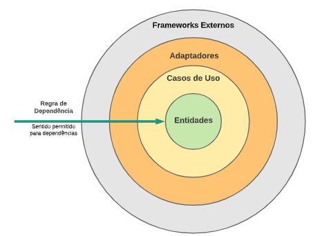

# Software Design

# Summary

- [. . /Home](../../README.md)
- [SOLID](#solid)
- [Clean Architecture](#clean-architecture)
- [Hexagonal Architecture](#hexagonal-architecture)
- [Domain Driven Design](#domain-driven-design---ddd)
- [Grasp](#grasp---general-responsibility-assignment-software-pattern)

# SOLID

## (S)ingle Responsibility
There should never be more than one reason for a class to change.
This principle aims to separate behaviors so that if bugs arise as a result of your change, it won’t affect other unrelated behaviors.

## (O)pen Close
Classes should be open to extension but closed for modification.

- **Extensibility**: New features can be added without modifying existing code.
- **Stability**: Reduces the risk of introducing bugs when making changes.
- **Flexibility**: Adapts to changing requirements more easily.

## (L)iskov Substitution Principle
Sates that functions that use pointers or references to base classes must be able to use pointers or references of derived classes without knowing it.

The main goal of LSP is to ensure that subclasses don't violate or weaken the behavioral meaning and guarantees of the base-class abstraction.

- **Polymorphism**: Enables the use of polymorphic behavior, making code more flexible and reusable.
- **Reliability**: Ensures that subclasses adhere to the contract defined by the superclass.
- **Predictability**: Guarantees that replacing a superclass object with a subclass object won't break the program.

## (I)nterface Segregation
States that clients should not be forced to depend upon interface methods that they do not use.

ISP splits interfaces that are very large into smaller and more specific ones so that clients will only have to know about the methods that are of interest to them.

## (D)ependency Inversion
- High-level modules should not import anything from low-level modules. Both should depend on abstractions (e.g., interfaces).

- Abstractions should not depend on details. Details (concrete implementations) should depend on abstractions.

**Tip:** There's a subtle distinction, though: DI doesn't automatically mean you're following DIP. You could inject a concrete class.

```text
IoC — general architectural idea
 ↓
"Who has control?"

DIP — design principle
 ↓
"Which direction should dependencies point?"

DI — concrete technique
 ↓
"How do I provide those dependencies?"
```


# Clean Architecture
https://engsoftmoderna.info/artigos/arquitetura-limpa.html

https://blog.cleancoder.com/uncle-bob/2012/08/13/the-clean-architecture.html

In general is called Clean Architecture because the core - entities and use cases - 
are "clean" of any technology.



- Entities and Use Cases
- Adapters
- Frameworks, libs, databases and others third party technologies. 
- Inverted Flow Control - External layer can depend of more internal layers (dependency rule)

> All details stay on frameworks and drivers.
Web is a detail, the database is a detail.
We keeping those technologies in the outer layer because it can do less danger.

# Hexagonal Architecture
https://engsoftmoderna.info/artigos/arquitetura-hexagonal.html


Also know as Port and Adapters, follow the same idea of Clean Arch that need to be avoided technological dependence from frameworks, databases,
focus on business rules, be easiest to test, etc.

Divide system classes in two main groups:
- Domain classes, that are directly linked with business rules.
- Classes that are related with infra, databases, third party libs, etc.

Domain classes should not depend of infra, database, etc classes.

# Domain Driven Design - DDD
Focus on bring the domain problem concepts, naming conventions, contexts and terms to software building blocks, the ubiquitous language. 
Achieving this by collaboration with domain experts and understanding the complexities. 
DDD offer principles, practices and patterns do deal with this approach.

> Domain - this refers to the specific subject area or problem that the software system aims to address.
>
> Driven - the design of the software system is influenced by the features and needs of the domain. Rather than technical aspects.
>
> Design - the process of making a plan or blueprint of a software system (in this approach) driven by domain.

## Strategic Design in DDD
- Bounded Context - breaks down large, complex domains into smaller, more manageable parts. 
Separate ubiquitous language / clear boundaries between concepts (even with same name), like a module about library and other finance, when in the first has User and other user become Customer.
-  Context mapping - The process of defining relationships and interactions between different Bounded Contexts.
Understand where context overlap or integrate, establishing clear communication and agreements.
   - Shared Kernel - two contexts deliberately share a small part of the domain model or codebase.
   - Partnership — two bounded contexts cooperate closely and coordinate changes.       
   - Customer-Supplier - one context acts as the supplier (upstream), while another is the customer (downstream); the supplier takes the customer’s needs into account. Upstream listens to downstream needs.
-  Strategic Patterns - General guidelines for organizing the architecture of a software system in alignment with the problem domain.
   -  Aggregates - protects consistency inside domain model.
   -  Domain Events - something that happened in the domain that you want other parts of the same domain (in-process) to be aware of.
   -  Anti-Corruption Layer - contains all the logic necessary to translate between the two systems or bounded contexts.
-  Shared Kernel - a strategic pattern that identifies common areas between different Bounded Contexts and establishes a shared subset of the domain model.
- Architectural Layers: ui, application, domain, infra.
-  Ubiquitous Language - is a shared vocabulary that all stakeholders use consistently during software development, effectively capturing the relevant domain knowledge.
Common goal is to share domain language among teams.

## Tactical Design Patterns in DDD
- Entity - has unique identifier. They are more important concept.
- Rich entity - business rules together with entities, likes OOP pray.
- Value Object - has no unique identifier, they are characterized by its current state.
- Aggregates - are aggregation/composition of objects handled as a unique abstraction. They are persisted and deleted as a unique too. Has the root entity aggregate concept.
- Repository - they role is to get domain objects of database (even another source like other API?). Its a abstraction for persistence. They encapsulate translation/mapping between those objects.
- Factory - creational design pattern.
- Service - carries business rules independent of objects and is stateless.


# GRASP - General Responsibility Assignment Software Pattern

It is a set of guidelines that helps you decide **which class should be responsible for what** in an object-oriented system.

The core GRASP principles are:

1. **Information Expert**
   Give a responsibility to the class that already has the information needed to perform it.

   Example: an `Order` knows its items, so `Order` should calculate its own total.

2. **Creator**
   A class should create another object when it closely owns, contains, or uses it.

   Example: `Order` can create `OrderItem` objects.

3. **Controller**
   Use a class to receive requests from the UI/API and coordinate the work.

   Example:

   ```java
   class OrderController {
       void createOrder() {
           // coordinates the use case
       }
   }
   ```

4. **Low Coupling**
   Classes should have as few dependencies on other classes as possible.

   Bad:

   ```java
   class Order {
       MySQLDatabase db;
       StripePayment payment;
       EmailService email;
   }
   ```

   Better: depend on abstractions and keep responsibilities separated.

5. **High Cohesion**
   A class should have a small set of closely related responsibilities.

   Bad:

   ```java
   class User {
       saveToDatabase();
       sendEmail();
       generatePDF();
       calculateTax();
   }
   ```

   That class is doing too much.

6. **Polymorphism**
   When behavior varies by type, use polymorphism instead of lots of `if`/`switch` statements.

   Instead of:

   ```java
   if (paymentType == CREDIT_CARD) ...
   else if (paymentType == PIX) ...
   ```

   use:

   ```java
   interface Payment {
       void pay();
   }

   class CreditCardPayment implements Payment { ... }

   class PixPayment implements Payment { ... }
   ```

7. **Pure Fabrication**
   Sometimes you create a class that does not represent a real-world domain object, just to keep the design clean.

   For example:

   ```java
   class UserRepository {
       void save(User user) { ... }
   }
   ```

   `UserRepository` isn't really a business object, but it's useful because it keeps persistence logic away from `User`.

8. **Indirection**
   Introduce an intermediate object to reduce coupling between two components.

   For example:

   ```text
   Order → PaymentService → Stripe
   ```

   instead of:

   ```text
   Order → Stripe
   ```

9. **Protected Variations**
   Identify things that are likely to change and hide them behind a stable interface.

   For example:

   ```java
   interface PaymentGateway {
       void charge();
   }
   ```

   Then you can have:

   ```text
   StripePaymentGateway
   PayPalPaymentGateway
   MercadoPagoPaymentGateway
   ```

   Your business logic doesn't care which one is used.

A useful way to think about **GRASP vs SOLID** is:

* **GRASP:** “Where should this responsibility go?”
* **SOLID:** “How should I structure these classes so the design stays maintainable?”

For example, if you're building an e-commerce system and ask:

> Who should calculate the order total?

GRASP says: use **Information Expert** → probably `Order`, because `Order` already knows its items.

```java
class Order {
    List<OrderItem> items;

    Money total() {
        return items.stream()
            .map(OrderItem::subtotal)
            .reduce(Money.ZERO, Money::add);
    }
}
```

So the main idea to remember is:

**GRASP = principles for deciding which object gets which responsibility.**

[Article on Wikipedia about GRASP](https://en.wikipedia.org/wiki/GRASP_(object-oriented_design))
