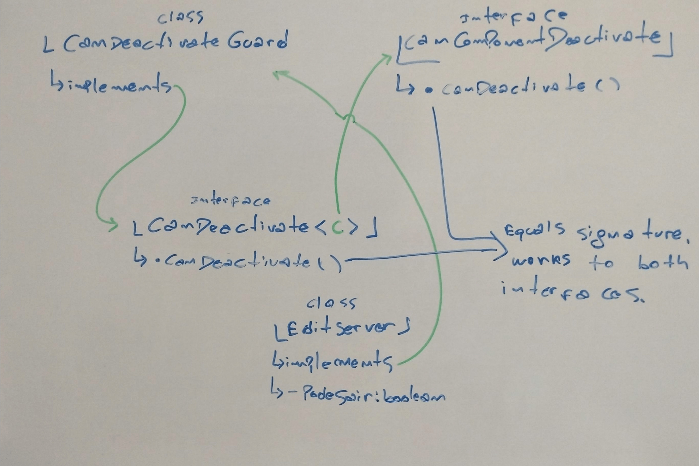

# Angular Reference

# Summary

- [. . /Frameworks](../frameworks.md)
- [Start](#start)
- [Forms](#forms)
- [Components](#components)
- [Data Binding](#data-binding)
- [Directives](#directives)
- [Services and DI](#services-and-di)
- [Routing](#routing)
- [RxJS](#rxjs)


## Start
- Angular changes DOM at runtime. He uses shadow DOM to improve speed and 
changes in an optimized way.
  
- How a SPA, the deployed file is the index.html. Knowing the tag name of the 
custom element defined by the selector property in the root component
(app.component.ts), in this case ``<app-root>, Angular will render this component
inside index.html body on <app-root> custom element.
  
- How Angular starts to run custom element <app-root> inside ``index.html``:
The final file deployed is filled with Javascript bundle imports that are
injected by the ``ng serve`` process between rebuilds. So in the final bundle,
there will exists our code too.

- The first code executed is from ``main.ts``. It imports the ``app.module`` and passes
it to Angular's boostrap/start method to initialize the application. 
The boostrap array in app.module.ts has all the components that should be known 
to Angular when parsing index.html. Here the cycle of references closes because
I am referencing the app itself.

- So the summary: Angular starts with ``main.ts`` which receives the ``AppModule`` as 
an argument. In this module, we tell Angular in the bootstrap array which
components it should know when starting itself (the module itself, because you
should remember that we can have multiple modules. In the next chapters). 
Angular parses it, reads its setup, and knows its ``app-root`` selector. Now he
knows how to deal with the custom tag in ``index.html``, ``<app-root>``, as he knows 
the selector described by knowing the component and its dependencies in the 
bootstrap array. Now he knows that he should insert the component here and he 
has some HTML in this case he inserts what he has in app.component.html.

## Forms

It's only possible to use ``[(ngModel)]="name"`` if the 
``import {FormsModule} from '@angular/forms'`` dependency are imported in
``app.module.ts`` like [here](./learn-angular/src/app/app.module.ts).

## Components
- New components are created inside the ``app`` folder by the CLI and you can specify the module if there is more than one using ``-m module-name``, use ``--path start-by-root/src/etc`` to specific path. Example:  
  > ``ng generate component name-component`` 
  
  > ``ng g c name-component -m module-name --path start-by-root/src/etc``
- The angular selectors start with ``app-`` because are encouraged by the 
angular to follow the convention about custom elements. You can remove this 
manually or remove it in the "prefix" property on the angular.json.
- Angular uses components to build web pages and modules to bundle different 
pieces into packages.
- Modules in Angular are containers for cohesive code blocks to an application
domain, workflow, or closed related capabilities. 
- Selectors are used as the custom element name. 
- All components must have a template. It can be a ``templateUrl`` in 
``@Component`` pointing to an external file or a ``template`` that is a html
directly in the property.
- A component can have multiple external css files, inline styles 
(inside component.ts) have high precedence and you can use multiples strings 
to define css. 

### CSS
  
CSS is only applied to elements belonging to the component. Angular uses a trick
to CSS don't have your default behavior (act in a whole document), by creating
custom attributes and using them as filters like this:
```html
<div _ngcontent-ctg-c41="" class="panel-body">
  <p _ngcontent-ctg-c41="">
    <em _ngcontent-ctg-c41="">Tenório</em>
  </p>
</div>
```
```css
p[_ngcontent-ctg-c41] {
  color: blue;
}
```
So, only elements belonging to the component will have ``_ngcontent-ctg-c41`` 
attribute and therefore the CSS only will be applied to those components. 

You can change this behavior adding extra information to ``@Component`` 
decorator. The default value to view encapsulation is
``ViewEncapsulation.Emulated``, but you can do:
```ts
@Component({
  selector: 'app-server-element',
  templateUrl: './server-element.component.html',
  styleUrls: ['./server-element.component.css'],
  encapsulation: ViewEncapsulation.Emulated //None or ShadowDom
})
```

- Can i have selector that acts like a custom element, a property or class 
like [here](./learn-angular/src/app/02-the-basics/servers/servers.component.ts).

### Receiving Data

You can create custom properties in your component that can be received from
outside, like a ``parent -> child`` sending data. 
[Here's a example](./learn-angular/src/app/05-components-databinding/server-element/server-element.component.ts):
```ts
//Child component
export class ServerElementComponent implements OnInit {
  @Input('srvElement') element: {type: string, name: string, content: string}
}
```
Your child component ``ServerElementComponent`` define a custom property called ``element``, which outside from component are called ``srvElement`` and can receive data using property [binding like this](./learn-angular/src/app/05-components-databinding/components-databinding-wrapper/components-databinding-wrapper.component.html):
```html
<div class="col-xs-12">
  <app-server-element 
    *ngFor="let item of serverElements"
    [srvElement]="item"
  ></app-server-element>
</div>
``` 
### Sending Data

You can create custom properties in your component that can send data to outside, like a ``parent <- child``. [Here's a example](./learn-angular/src/app/05-components-databinding/cockpit/cockpit.component.ts):

```ts
//Child component
export class CockpitComponent implements OnInit {
  @Output() serverCreated = new EventEmitter<{serverName: string, serverContent: string}>();
  @Output('bpCreated') blueprintCreated = new EventEmitter<{serverName: string, serverContent: string}>();
```
Your component creates custom properties called ``serverCreated`` and ``blueprintCreated``, and the second one has an alias called ``bpCreated`` which is your name outside the custom element/component. Both have ``EventEmitter<>`` type, which in the diamond carries the type of data he will send. 

To send the data to the parent custom element/component you can do this:
```ts
  onAddServer() {
    this.serverCreated.emit({serverName: this.newServerName, serverContent: this.newServerContent});
  }
```

You can listen in a parent to those event emitters [like this](./learn-angular/src/app/05-components-databinding/components-databinding-wrapper/components-databinding-wrapper.component.html):

```html
<div class="container">
  <app-cockpit 
    (serverCreated)="onServerAdded($event)"
    (bpCreated)="onBlueprintAdded($event)"
  ></app-cockpit>
</div>
```

### Local Reference In Templates

You can use ``#someNameToReference`` in any HTML element from your template. By doing this you achieve a way to reference the own element itself anywhere on your template, but not in Typescript code. Example of naming a local reference and using it as a parameter to an event on a button:
```html
<input 
  type="text" 
  class="form-control"
  #serverNameInput> <!-- reference -->
<label>Server Content</label>
<input type="text" class="form-control" [(ngModel)]="newServerContent">
<br>
<button
  class="btn btn-primary"
  (click)="onAddServer(serverNameInput)">Add Server</button>
```
```ts
onAddServer(nameInput: HTMLInputElement) {
  this.serverCreated.emit({serverName: nameInput.value, serverContent: this.newServerContent});
}
```
### ViewChild
ViewChild in Angular is a tool that allows you to access template elements directly in the component. When using the ``@ViewChild()`` syntax, it is possible to pass the name of the local reference and the type of the desired component, resulting in a search for the first occurrence of this element in the component template:
```ts
@ViewChild('serverContentInput') serverContentInput: ElementRef;
...
onAddServer(nameInput: HTMLInputElement) {
  this.serverCreated.emit({
      serverName: nameInput.value, 
      serverContent: this.serverContentInput.nativeElement.value
    });
}
```
```html
<input 
  type="text" 
  class="form-control"
  #serverContentInput>    
```

However, it is important to highlight that manipulating the DOM directly through ``ViewChild`` is not considered good practice. Direct access to template elements in any component cannot be done, but it is recommended to avoid direct DOM manipulations whenever possible.

A specific consideration for versions from Angular 8 onwards is the need to add ``{ static: true }`` as a second argument when using ``@ViewChild()  n``. This change must be applied to all instances of ``@ViewChild()`` with the intention of accessing the selected element within the ``ngOnInit()`` method. If access occurs anywhere else in the component, you must use { static: false }.

For Angular 9 versions from now on, just adding ``{ static: true }`` (if necessary) is enough, and adding ``{ static: false }`` is no longer necessary.


### Content Projection
> https://angular.io/guide/content-projection

> [Single Slot](./learn-angular/src/app/05-components-databinding/server-element/server-element.component.html)


In Angular, by default, everything inside the opening and closing tags of a component or element is automatically removed. This can be understood as if the variables were in a temporary scope intended exclusively for passing to the component.

The ng-content directive is introduced as a hook, used as a selector in the component to indicate where Angular will inject the content between the opening and closing tags when the component is called. It is mentioned that, by default, injected HTML inherits the CSS scope of the component that is injecting it.

This by default is single-slot content projection, but there are also multi-slot content projection and conditional content projection.


### Lifecycle Hooks
> https://angular.dev/guide/components/lifecycle

> [Lifecycle](./learn-angular/src/app/05-components-databinding/server-element/server-element.component.ts)


Exits some types of hooks, some of them are: hooks to view init and to
content init (content are the HTML passed between tags).


## Data Binding
- Binding possibilities:
  - TS -> TEMPLATE: String interpolation ``{{ data }}`` or property binding ``[property] = "data"``. One-way. 
  - TS <- TEMPLATE: User events like ``(event) = "expression"``. One-way.
  - TS <-> TEMPLATE: ``[(ngModel)] = "data"``. Two-way.

- In string interpolation i can: ``{{ TS expression that can be resolve a string  }}``. You can't use multline and codeblock expressions (if, for, etc).
- Surrounding a property with [] tell to angular that you are using property binding. For each attribute you can have a type to be resolved,  ex: in ``[disabled]="will be resolved to boolean"`` inside quotes in this case everything will try to be resolved as a boolean value.
- Two-way data-binding is a combination of property and event binding: ``[(ngModel)]``.
- Types: interpolation, event, property, and two-way.


## Directives

Directives are classes that add additional behavior to elements in your Angular applications. Use Angular's built-in directives to manage forms, lists, styles, and what users see.

 - ``*`` is extra information to Angular that the ``ngIf`` for example(or whatever directive is) changes de structure of DOM adding or not an element. So must use ``*ngIf``.
 - ``#something`` in else is a local reference (deep later).
 - Remember that directives are different than property binding, so, ``ngStyle`` is a directive when used like ``[ngStyle]`` you are indicating that you are binding a property called ``ngStyle`` in one-way binding. We are binding to a property of the directive. A directive are name in your file as ``[directiveName]`` only to say for Angular that: "Hey, select this thing
like a attribute".


| Structural   | Attribute   |
|---|---|
| Look like a normal HTML Attribute but have a leading * (for desugaring)   |  Look like a normal HTML Attribute (possibly with databinding or event binding) |
| Affect a whole area in the DOM (elements get added/ removed) | Only affect/ change the element they are added to |


When a directive are created the selector used in your TS file is ``'[directiveName]'``, which means only that Angular will find him based on a CSS attribute like. 
When you call, the syntax are like ``<p directiveName>Ok!</p>``.

It's not a good practice to access DOM directly (for example, using ElementRef). Some cases there ir no DOM to acces and will take a error, 
instead use ``Render2``, its a better approach because Angular will resolve how to set the property in which environment you be.
Examples [bad practice](./learn-angular/src/app/07-directives-deep-dive/basic-highlight.directive.ts) and 
[good practice](./learn-angular/src/app/07-directives-deep-dive/better-highlight.directive.ts) 

```js
  constructor(
    private elRef: ElementRef,
    private renderer: Renderer2
  ) { }

  ngOnInit() {
    this.renderer.setStyle(this.elRef.nativeElement, 'background-color', 'blue');
  }
```


Listening events in a directive to do reactive things like mouseenter, etc using [@HostListener](./learn-angular/src/app/07-directives-deep-dive/better-highlight.directive.ts).

```js
  @HostListener('mouseenter') mouseover(event: Event) {
    //TODO 
  }
```


You can bind properties using [@HostBinding](./learn-angular/src/app/07-directives-deep-dive/better-highlight.directive.ts), Angular know if is a property binding or a HostBinding check if propoerty exists in a tag or in a directive. To use like ``[style]`` that don't is enclosed you can create a input with same name of
property or a alias like [here](./learn-angular/src/app/07-directives-deep-dive/better-highlight.directive.ts) and [here](./learn-angular/src/app/07-directives-deep-dive/root-07-directives-deep-dive/root-07-directives-deep-dive.component.html).
When you are passing a string with '' and [] you can remove to simplify, careful because its clear that indicate a property binding, like
[here](./learn-angular/src/app/07-directives-deep-dive/root-07-directives-deep-dive/root-07-directives-deep-dive.component.html).


Star (\*) in structural directives are only a sintax sugar to us, behind the scenes Angular translate them and use the primitive binding
types (property, string interpolation, event and two-way). We can achive as a example, like [this](./learn-angular/src/app/07-directives-deep-dive/root-07-directives-deep-dive/root-07-directives-deep-dive.component.html). Also, star (*) transform the in ``ng-template`` syntax and then 
try to property bind in directive name, that is, ``appUnless``.


## Services and DI

Services are place to centralize business rules, use cases or state for those things, so that other components can interact with them.

A TS class without DI (constructor, for example) can be used as a service,
but it's not recommend because with this approach you won't use Angular DI
to handle the object lifecycle.

### Hierarchical Injection

Angular DI are build with the Hierarchical Injection.
Thinking in a component tree, a service injected in a specific component
are the same for those component and all his child components
(see how to get this behavior and also avoid). This behavior are only
granted to down (childs) not the up in the tree. For example:


In this example, we have a service ``S0`` that are inject in ``root`` component and components ``c1`` and ``c1.1`` receive the same instance (them don't use ``providers: [S0]``). In ``c2`` and ``c2.1`` we have the same instance of ``S0``, but we inject ``S1`` service in ``c1``. But, in ``c2.1`` the ``S1`` are inject using DI but are used ``providers: [S1]``, so that we have a new instance of ``S1"``.

Some observations about services scopes:
- Highest level is the app module, the service are available
to all application.
- In the app component, is available to all components, but not for other services.


To receive another service being inject in your service, we need to 
decorate the service that are receiving another with ``@Injectable()``. 
The service that are inject don't need this annotation, but it's a good
practice put to evict problems in future versions.

In Angular 6+ we can provide a visibility/scope of a service using
the decorator ``@Injectable(providedIn: 'root')``, when 'root' are for the
all application like app module.


## Routing

With this, you can navigate between pages/components, pass parameters, query strings, load data, create rules with guards to some routes, load child
routes using ``router-outlet`` and much more.

You can import ``RouterModule`` in ``AppModule``, craete a const array
with your routes and with ``.forRoot()`` add them to ``RouterModule``.

The ``router-outlet`` marks the place when de route component will render.
Remember that with nested paths you can have N ``router-outlet`` `s.
Always keep in mind that to deal with ambiguous paths/routes.

You can organize routes using modules and than import them in ``AppModule`` to have a better code architecture.

### Navigating

It's not cool to use reload in a SPA, so try to use always ``routerLink="some"`` or ``[routerLink]=['some', 10]`` to navigate away.

There are two types of routes talking about ``routerLink``: absolute ("/some")
which will look to the root of your RouterModule and go to /some and
relative ("some") which will append to the current URL.
You can navigate back like "../some" that will back and apply /some,
remember that it not back only one segment but the entire loaded route
(remember about nested paths).

You can stylize something based if the routes are active or not, to do
this exist [routerLinkActive](./learn-angular/src/app/11-changing-pages-with-routing/root-11-changing-pages-with-routing/root-11-changing-pages-with-routing.component.html#6).
He looks to the current path (if is part of or even leads to the current path), loaded components and applies the CSS based on this approach. 
To apply to only an exact match you can use [routerLinkActiveOptions](./learn-angular/src/app/11-changing-pages-with-routing/root-11-changing-pages-with-routing/root-11-changing-pages-with-routing.component.html#7).

To programmatically navigate, you can use [Router.navigate()](./learn-angular/src/app/11-changing-pages-with-routing/servers-11/server-11/server-11.component.ts#28).
Using this method, Angular doesn't know where you are, so to
do some append in route and other logic that it's necessary to know
where you are, you need to provide ``relativeTo: ActivatedRoute`` to 
tell Angular the active.

Path variables like ``/users/:id`` are interpreted by Angular as 
dynamic part of URL. To send them, you can mount the URL with
them using [routerLink](./learn-angular/src/app/11-changing-pages-with-routing/servers-11/servers-11.component.html#5)
or with [navigate()](./learn-angular/src/app/11-changing-pages-with-routing/home-11/home-11.component.ts#20). To get those things you can use a [snapshot](./learn-angular/src/app/11-changing-pages-with-routing/users-11/user-11/user-11.component.ts#19)
to get the data in a specific time or [subscribe](./learn-angular/src/app/11-changing-pages-with-routing/users-11/user-11/user-11.component.ts#24)
in an observable to get all changes (Angular automatically unsubscribes these subscriptions) and remember that the type is string when you receive.
It if is needed to keep/merge the query params and fragments when navigating between
routes, you can use [queryParamsHandling and preserveFragment](./learn-angular/src/app/11-changing-pages-with-routing/servers-11/server-11/server-11.component.ts#28).

To deal with query params and go to specific HTML elements (e.g fragment) you can use
[[queryparams]={ key: value } and fragment=htmlTag](./learn-angular/src/app/11-changing-pages-with-routing/servers-11/servers-11.component.html#6) in a template.
Using the ``Router`` you can work with [navigate()](./learn-angular/src/app/11-changing-pages-with-routing/home-11/home-11.component.ts#20).
To get those things you can deal with the same ``ActivatedRoute`` getting 
[snapshot or observable](./learn-angular/src/app/11-changing-pages-with-routing/servers-11/edit-server-11/edit-server-11.component.ts#28)
and remember to convert the data because is a string.

### Handle Unknown Routes

To handle all unknown typed routes you can use ``**`` as wildcard being the
last route. By default, Angular matches paths by prefix which means that the router checks URL elements from the left to see if the URL matches a specified path. For example, '/team/11/user' matches 'team/:id'. You can specify the path-match strategy ``pathMatch`` 'full' to make sure that the path covers the whole unconsumed URL. You can ``redirect`` to some routes too.

In a module, the property ``exports: []`` exposes what is accessible from the
module itself to who is imported.

### Guards

Guards are hooks when you enter and exit a route, respectively
``canActivate``, ``canActivateChild`` and ``canDeactivate``. You can protect the whole route
(current and children) or only children.
They can work with block and non-blocking processing.

Talking about class-based (deprecated), basically you will:
- Implement an interface in a service [here](./learn-angular/src/app/11-changing-pages-with-routing/auth-guard.service.ts)
- Exposes like [here](./learn-angular/src/app/11-changing-pages-with-routing/changing-pages-with-routing-artifacts.ts#29)
- Import in a route definition, [like](./learn-angular/src/app/11-changing-pages-with-routing/changing-pages-with-routing-artifacts.ts#45)


With functional-based, you can just create a [function inline](./learn-angular/src/app/11-changing-pages-with-routing/changing-pages-with-routing-artifacts.ts#58) 
or work with [exports](./learn-angular/src/app/11-changing-pages-with-routing/guards-functional.ts) to have better organization.

If you want to use the component state to execute some logic in deactivate,
one approach is:
- Create an interface like CanComponentDeactivate  that will be injected (class-based)
- Create a Guard and implement ``CanDeactivate<CanComponentDeactivate>``
- Implement the Guard (in TS a class can implement other [see.](https://stackoverflow.com/questions/38834625/extends-and-implements-difference-typescript))
  


It works because when `EditServer` implements the guard the method in the contract is equal in both interfaces (see the image) and fulfills the role to respect both contracts.

You can pass data in routes using [data property](./learn-angular/src/app/11-changing-pages-with-routing/changing-pages-with-routing-artifacts.ts#L56). It's a valid approach to reuse code.

### Resolvers - Load Data

To load some data before entering in route/load component you can use
the interface (class-based) [Resolver](./learn-angular/src/app/11-changing-pages-with-routing/servers-11/server-11/server-resolver.service.ts) and use the property in a [route](./learn-angular/src/app/11-changing-pages-with-routing/changing-pages-with-routing-artifacts.ts#L50). To get the data, use ``ActivatedRoute`` with the same
name used in a property like [here](./learn-angular/src/app/11-changing-pages-with-routing/servers-11/server-11/server-resolver.service.ts#L20).


You can the new approach with ``ResolveFn`` following the function-based 
approach. An [example](./learn-angular/src/app/11-changing-pages-with-routing/guards-functional.ts#L23) and getting the
[data](./learn-angular/src/app/11-changing-pages-with-routing/changing-pages-with-routing-artifacts.ts#L43).

### Location Strategies
> [Source](https://www.tektutorialshub.com/angular/angular-location-strategies/)

There are two ways to navigate in Angular, this is called
LocationStrategy: Hash(old) and Path(new with HTML5), this defines how 
our URL/Request is resolved. This approach looks like this:

- **HashLocationStrategy** Where URL looks like http://localhost:4200/#/product. 

The Hash style routing uses the anchor tags technique to achieve
client-side routing. The anchor tags, when used along with the # allow us
to jump to a place, within the web page. When the requested anchor tag is
on the current page, then the browser does not send the request to the Web server.
Only the URL sent to the server is ``http://localhost:4200``, the ``#/product`` is never sent to the server.
- **PathLocationStrategy** Where the URL looks like http://localhost:4200/product.
Using history.pushState() method, we can now programmatically add the
browser history entries and change the location without triggering a
server page request. 

What would happen, when you type the URL http://www.example.com/ProductList and hit the refresh button.

The browser will send the request to the web server. Since the page ProductList does not exist, it will return the 404 (page not found) error.

This problem could be solved, if we are able to redirect all the requests to the index.html

It means that when you ask from http://www.example.com/ProductList, the Web server must redirect it to index.html and return the request. Then in the Front-end Angular will read the URL and dynamically load the ProductListComponent.

To make HTML5 routing work you need to send the instruction to the webserver to serve /index.html for any incoming request, no matter what the path is.


## RxJS 

RxJS is a library for composing asynchronous and event-based programs by using observable sequences. It provides one core type, the Observable, satellite types (Observer, Schedulers, Subjects) and operators inspired by Array methods (map, filter, reduce, every, etc) to allow handling asynchronous events as collections.

ReactiveX combines the Observer pattern with the Iterator pattern and functional programming with collections to fill the need for an ideal way of managing sequences of events.

The essential concepts in RxJS which solve async event management are:

- Observable: represents the idea of an invocable collection of future values or events.
  
- Observer: is a collection of callbacks that knows how to listen to values delivered by the Observable.

- Subscription: represents the execution of an Observable, is primarily useful for cancelling the execution.
 
- Operators: are pure functions that enable a functional programming style of dealing with collections with operations like map, filter, concat, reduce, etc.

- Subject: is equivalent to an EventEmitter, and the only way of multicasting a value or event to multiple Observers.

- Schedulers: are centralized dispatchers to control concurrency, allowing us to coordinate when computation happens on e.g. setTimeout or requestAnimationFrame or others.

A basic resume with how to:
> [Here](./learn-angular/src/app/13-understanding-observables/obs-sub-beh/obs-sub-beh.component.ts)
some examples to create, subscribe and dispose some Observables
and its derived types like: Subject and BehaviorSubject.

> [Here](./learn-angular/src/app/13-understanding-observables/obs-sub-beh/obs-sub-beh.component.html)
how to use them in templates with variables and yours subscriptions.
Another way is to use angular ``async`` pipe, that handles the
disposing to Observables.


