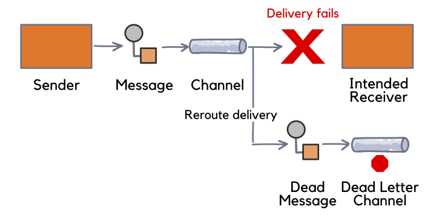

# Event-Driven Architecture - EDA

## Error Handling 

### Dead Letter Queue - *DLQ*

It's an approach that consists of sending to a different queue (DLQ) messages that can't be processed, sent to the correct queue or lose your TTL, for example. Redirection is made by the broker itself or a middleware.

Fonte: [redpanda](https://redpanda.com/blog/reliable-message-processing-with-dead-letter-queue)

In the DLQ the message can be reprocessed automatically, inspected to help in the troubleshooting or even manually reprocessed.