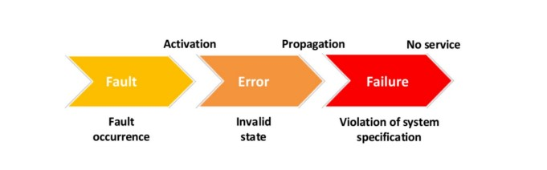

# Fault Tolerance 

# Sumário 

- [. . /Distributed Programming](../dp.md)
- [Introduction](#introduction)
- [Availability and Dependability](#availability-and-dependability)
- [Strategies To Fault Tolerance](#strategies-to-fault-tolerance)
- [Fault Tolerance Patterns](#fault-tolerance-patterns)
- [Patterns of Error Detection](#patterns-of-error-detection)
- [Patterns of Error Recovery](#patterns-of-error-recovery)
- [Patterns of Error Detection](#patterns-of-error-mitigation)
- [Redundancy and Diversity](#redundancy-and-diversity)
- [Fault Tolerance in Distributed Systems](#fault-tolerance-in-distributed-systems)

# Introduction

## Caracteristicas
- Capacidade de Operação continua
Continua mesmo com erros ou falhas inesperadas.
- Resistência a erros
Detectar, isolar e corrigir erros automáticamente sem interrupção do serviço.
- Redundância e replicação
Como componentes duplicados, cópia de dados.
- Manutenção da disponibilidade
Continuar online e acessivel mesmos em situações diversas

Disponibilidade: High Availability
Serviço online e cumprindo seu próposito. Resistente a falha de hardware, software e energia, objetivo é manter o máximo de tempo possível.

## Causas mais comuns das falhas em sistemas
- Erro de programação (bugs)
- Suposição errada sobre os requisitos
- Falta de entedimento do usuário
- Hardware defeituoso (ou desgastado)
- Distúrbios externos (ambiente: radiação, etc)
-Interação humana maliciosa (ataque por hackers)

## Examplos de falhas e suas causas

Fault(Defeito latente, pode estar no software, hardware, projeto, etc. Conhecido como bug) -> Error (estado invalido, causado pela falha) -> Failure (Defeito, quando não presta o devido serviço)

Um sistema confiável requer controle de falhas (faults). Elas devem ser prevenidas, removidas, previstas ou toleradas.

## Cadeia de Causalidade

Failure em um componente pode ser visto como fault no nível acima (um sistema com multiplos componentes).

Fault não ativada é dormente, quando ativada produz um erro.

Um erro é latente quando não é detectado.
Um erro propagado, pode produzir uma failure.

## Classificaço da Falha
- Causa: erro de logica, hardware, requisitos, etc.
- Localidade - ao ponto onde a falha foi originada.
- Duração - Permanente, transiente e  intermitente.
- Efeito - causado ao usuário do serviço (pode ser uma pessoa ou um sistema que consome outro sistema). Dados invalidos, tempo fora do especificado, etc.

## Categorização das Falhas

- Por queda - para prematuramente
- Por omissão - não responde a requisições feitas, nao recebe mensagens que espera.
- Temporização - Responde fora do intervalo de tempo esperado.
- Resposta - Responde de forma incorreta.
- Transição de estado - responde a uma requisição indo para um estado inválido.
- Arbitrária ou Bizantina - Quando o sistema de detecção de falhas não consegue decidir se a falha existe. Produz saidas que não deveriam, mas o sistema não consegue detectar como incorretas. Comum em distributed systems.
- Por parada - cai, para de produzir saidas ou respostas.

## Boas Práticas de Projeto de Sistemas Tolerante A Falhas
- Modularidade\
Decompor, minimizar dependência entre módulos.
Criar mecanismos de contenção de falhas par anão propagar para outros modulos do sismtema.
- Modulos fail-fast\
Funcionan como deveria ou detecta a falha rapido e emite um sinal. Objetivo de diminuri latência entre ocorrencia do erro e detecção. Evitar propagar pra muitas partes.
- Retentar ações que falham (retry)\
Estabelecer checkpoints efetivos. Em caso de falhar refazer considerando o ultimo checkpoint.
- Utilizar transações para manter integridade\
Considerar atomicidade de ações.

# Availability and Dependability

Availability - sistema estar disponível e cumprindo com sua funcionalidade.
Tem a ver com minimizar o tempo de interrupção do serviço esperado, ou
probabilidade do sistema estar operando em um dado momento no tempo.

## Termos relacionados

- Disponibilidade (do inglês, Availability)
  - Porcentagem de tempo em que um serviço está
operando corretamente, em comparação com seu
tempo total de operação programado
- Confiabilidade (do inglês, Reliability)
  - Probabilidade do serviço atender ao esperado por um
período de tempo desejado
- Dependabilidade (do inglês, Dependability)
  - é uma medida da disponibilidade, confiabilidade,
manutenibilidade de um serviço e, em alguns casos,
durabilidade e segurança.

## Availability vs Reliability

- Sistema que falha por 1 milissegundo a cada hora\
Disponibilidade Alta (> 99.9999%)\
Confiabilidade baixa
- Sistema que ficou indisponível por 2 semanas no ano por causa de uma falha\
Disponibilidade Baixa (= 96%)\
Confiabilidade Alta

## Availability and Failure

Availability está relacionado a falhas no sistema e seus impactos.
Uma falha ocorre quando não é possível atender o usuário de maneira consistente,
ainda pode ser total ou parcial.

Quando o sistema falha?
R: Switchover(manual) vs Failover(automático. Após voltar tem o Failback)

## Como tratar falhas?

- Prevenção de falhas - como metodos formais.
- Eliminação de falhas - remover falhas ja introduzidas.
- Previsão de falhas - prever ou estimar as falhas atuais, futuras e suas consequências.
- Tolerância a falhas - manter o sistema operacional mesmo na presença de falhas.

# Strategies To Fault Tolerance

> To achieve high availability it's needed a strategy!

Pensamento chave - para atingir high availability o sistema precisar ser tolerante 
a falhas, então é necessário adotar técnicas para tal.

> Fault tolerance its a property that a system can continue operating even after 
errors occur in your constituent components. The system can provide 
functionality even in errors presence.

Fault/Falha - Bug\
Error/Erro - Estado incorrendo do sistema, causado pela falha.\
Failure/Defeito - Quando não presta o serviço, desvio do esperado.

## Fases da tolerância

> Lidam com o erro no sistema

### Detecção do erro
Identificar um estado errôneo que pode levar a uma falha
no sistema se nenhuma ação corretiva for feita. Tradeoff entre complexididade de implementação,
overhead com relação a perda de desempenho pela chegagem runtime.

- Técnicas 
  - Duplicação e comparação: testes entre implementações iguais/alternativas.
  - Checagem de tempo: Execução com base em restrição de tempo. Ex. comum watchdog timer (acho que é heartbeat).
  - Checagem reversa: x -> h(x) -> y e y -> h_inversa(x) -> x
  - Checagem de codificação: Utiliza informação redundante para checar consistência, como codigo de paridade, checksum, MD5, SHA-1/2, etc.
  - Checagem de razoabilidade: Se a resposta não tem algo absurdo como em graus no RN ser -10 Celsius.
  - Checagem estrutural: Usado em ds mais complexas, tipo um ponteira na head para 
o ultimo elemento de uma lista ligada.
  - Diagnostico: O proprio sistema tem uma bateria de testes para verificar sua integridade.

### Confinamento do erro e avaliação do dano
Não a garantia que tudo indesejado foi
identificado com relação a falha, pode ter se espalhado pra outros componentes.
Necessário está etapa para avaliar a extensão dos dados.

- Técnicas 
  - Ações atômicas
  - Operaçoes encapsuladas:
  - Isolamento de processos:
  - Regras do tipo, tudo que não é permitido é proíbido:
  - Controle de recursos:

### Recuperação do erro
Tem o objetivo de eliminar o estado errôneo. Realiza intervenção no sistema.

- Recuperação da falha
  - Técnicas de recuperação por retorno: backward error recovery. Ex: db.
  - Técnicas de recuperação por avanço: forward error recovery. Ex: sinal de TV.

> Foco na causa do erro (falha)

### Tratamento da causa e continuidade do serviço
Localizar, identificar e compreender o erro.\
Consertar e recuperar partes do sistema.\
Ps: Lembrar sempre de possíveis side-effects e trata-los.

## Mascaramento
As falhas não aparecem pro usuario (Ação nao pode ser concluida, tente novamente mais tarde, etc). Coisas do tipo.

## Mecanismos
Replicação de componentes - hardware, software, informação, etc.\
Códigos de correção de erros - Checksum, etc.\
Programação em N-Versões - Por especificação, empresas distintas, etc.\
Blocos de recuperação - Ideia de transação de bd: begin, commit, rollback, etc.

# Fault Tolerance Patterns

## Error Detection
- Acknowledgement - confirma recebimento e processamento do dado ou requisição.\
Existe os papéis de monitoring system (sender, timer) and monitored
system (receiver and acknowledger).
- Circuit Breaker - evitar propagação de falhas, baseado em fail fast e baseado na ideia de um disjuntor. Pode ser open, closed and half-open.

## Error Recovery
- Roll Forward - é aplicado quando o sistema é capaz de carregar um novo estado válido. Tem mais, ver slide.
- Roll Back - volta para o último estado válido.

## Error Masking
- Active Replication - Um conjunto de componentes recebem a
mesma entrada e realizam o
processamento em suas entradas de
forma independente e simultânea.
Ideia de voting.

# Patterns Of Error Detection

- Fault Correlation - identificar padrões entre multiplos eventos, ideia de correlation id, tracing e log, por exemplo. 
Ideia também de session id, por que pode ter problemas relacionados a um conjunto de coisas feitos na sessão. Transaction id, etc. 

- Error Containment Barrier - evitar propagação. Akka framework. (Dependency command patterns, what is?)

- Verificação completa dos parâmetros: valida-los.

- System monitor - ver sobre cpu, memoria, rede, serviços, etc. Cuidado com o overhead. Aqui entra prometheus, zabbix, etc.

- Heartbeat - Ver se o sistema ta up. O serviço que envia a info.

- Watchdog - Monitora e atua no componente/serviço reiniciando.

- Realistic Threshold - Limites para uma operaçao normal. CPU, RAM, tempo, etc.

- Leaky Bucket Counter - Contador de falhas. Balanceia falhas com necessidade de intervação. Aparece no circuit breaker.

- Riding Over Transients - Ignorar falhas temporárias. Ex: falha em pacote de transmissão para tv.

- Métrica existentes - Aproveitar métricas para derivar insights e não criar muitas métricas para dar overhead.

- Voting - Mesma pergunta pra serviços, algoritmos, coisas diferentes e ver se eles concordam.

- Manutenção rotineira - prevenir falhas.

- Exercícios rotineiros - testes regulares. 

- Auditorias rotineiras - ver logs, etc coisas do tipo.

- Checksum - verificar integridade do dado.

- Acknowledgment - avisar quando algo é recebido e processado corretamente.

# Patterns Of Error Recovery

Restaurar um sistema ao seu estado operacional após uma falha.

- Quarentena - deixar um serviço/modulo/etc de lado ao apresentar erros
- Recuperação concentrada - recuperar uma parte crítica
- Error handling - Identifica erros in realtime e executa rotinas predefinas para
resolver os problemas automaticamente. Separar em handling blocks ajuda a tratar
e adicionar handlers futuros. Ex: Spring @ControllerAdvice e @ExceptionHandler.
- Reinicialização - erro irrecuperavel detecado, encerra de maneira segura e restarta.
- Limite de tentativas - sistema tenta se recuperar da falha indefinidamente. Ter um limite.
- Failover - mudar para um serviço/componente alternativo.
- Failback - voltar para o serviço principal.
- Restart - ...
- Limite de tentativas - Evitar loops infinito
- Rollback - Restore to previus valid state.
- Rollforward - ir para o proximo estado valido.
- Checkpoint - salvar um estado valido. Dados críticos, estados intermediário, logs, etc.
- Retorno ao ponto de referência - estáticos e sempre disponíveis como pontos de recuperação.
- Reinicialização de dados - Identifica dados corrompidos, remove ou reseta estes dados. Definido em tempo de design.
- What to save - refinamento do checkpoint com o que salvar. Ex: git salva tudo, svn salva os deltas, log de opoerações, etc.
- Remote storage - salvar em dispositivo externo.
- Error handler - se parar o código de tratamento do de negócio.

Redundancia ativa - ambos respondem (normalmente utilizada). Ex: lb.\
Redundancia passiva - dormente, só chamado quando o componente principal falhar.

# Patterns Of Error Mitigation

Tolerar a falhas - é mesmo na presença de erros continuar resiliente, operante. Conviver e lidar com elas.

## Patterns 
Overload Empires (Toolbox): lidar com sobrecarga. É um problema em si, pois o sistema não foi dimensionado corretamente.

- Deferrable work: escolher o que priorizar e o resto adiar, até retomar.
- Equitable Resource Allocation: auto explicativo. Ex: bulkhead.
- Queue for Resources: autoexplicativo.
- Protective Automatic Controls: Mecanismo automático pra prevenir sobrecarga. Quando atingir determinado threshold começar a limitar. Ex: throttling pattern.
- Expansive Automatic Controls: Escalar o sistema automáticamente para suportar. 
- Shed load: Priorizar processos essenciais, não fazendo coisas que não são essencias. Remoter depois.
- Share the load: autoexplicativo. Distribuir a carga.
- Slow it Down: Aceita a req mas executa em um tempo mais lento. Mandando uns sleep, por exemplo.
- Fresh work before stale: executar o mais recente primeiro. FIFO. Whats baixa as mensages mais recentes primeiro, feed, etc.
- Finishing work in progress: Terminar logo o trabalho que está sendo feito.
- Final Handling: Encerrar as coisas de maneira graciosa. Liberar recursos, encerrar processos de maneira correta.

# Redundancy and Diversity

Redudância alicerce para tolerancia a falhas. A maioria das tecnicas envolve algum tipo de redudancia.

Tolerância a falhas -> Redundância\
Redundância -/-> Tolerância a falhas

## Tipos de Redundância
- Redundância da informação: dados extras enviados/armazenados junto. Servem para detectar erro ou mascarar falhas.
- Redundância temporal: repetição no tempo de processamento. Take care about use same implementation to be redudant. Detectar e resolver falhas transitória.
- Redundância de hardware/software: replicar o componente e trabalhar em conjunto.
  - Redundância passiva: aguarda o problema acontecer na réplica principal pra receber carga de trabalho. Necessida de um mecanismo de switch.
  - Redudância ativa: As réplicas estão em operação simultaneamente.
  - Redundância hibrida: os dois casos ao mesmo tempo.

Trabalhar com probabilidads para aplicar esforços no que tem mais chances de dar problemas.

Diversidade: uso de diferentes abordagens e componentes para evitar falhas.
Existem vários tipos: hardware, software, funcional(algoritmos) e dados(fontes).

Redudância por si só não garante tolerância a falhas e a diversidade deve acompanhar a redundância. 

# Fault Tolerance In Distributed Systems

## O que são sistemas distribuídos?
- Múltiplos computadores
- Comunicação e coordenação
- Independência e autonomia

## Sistemas paralelos vs Sistemas distribuídos

## Principais desafios em sistemas distribuídos
- Gerenciamento de estado
- Tolerância a falhas
- Comunicação
- Escalabilidade

## Problema da Latência de Rede
- Atrasos de Comunicação
- Impacto na Consistência
- Efeito na Disponibilidade

## Sincronização de Estado entre Nós
- Replicação de Dados
- Conflitos de Versão

## Falhas de Comunicação e Partições de Rede
- Partições de rede - criando ilha isoladas de nós
- Split-Brain - diferentes partes dos sistema continuam operando independentemente
- Desafios de Reconexão - reintegrar partes requer cuidadosa sincronização

## Ponto Único de Falha - SPOF
- Queda de nós
- Redundância
- Balaceamento

## Falha Bizantina
- Podem agir de forma arbitrária, incluindo maliciosa
- Podem existir mensagens contraditórias enviadas uns aos outros
- Problema dos generais bizantinos
- Ordenação de eventos:
  - Cada nó possui um relógio independente, causando dificuldade de sincronização
  - Devido a latência e falta de relógio para todos os nós, eventos podem ocorrer fora de ordem aparente
  - Problema: determinar ordem global e consistente dos eventos em todos os nós do sistema

## Principais Abordagens

### Consenso Bizantino

Busca concordância entre componentes/nós em situações onde existe comportamento arbitrário/malicioso/defeituoso. Ex:\
- Valores enviados não podem ser considerados confiáveis
- Nós honestos não sabem quem são os maliciosos/defeitusos
- Nós maliciosos podem conspirar
- Nós honestos devem concordar em relação a mensagens recebidas

> Teorema: 3m + 1 nós para tolerar ``m`` nós maliciosos

Algoritmos:
- Lamport Shostak e Pease - Bizantine Generals Problem
- Practical Byzantine Fault Tolerance - PBFT
- Federated Byzantine Agreement - FBA

Aplicações conhecidas como: Bitcoin, Ethereum, Ripple, Stellar, etc.

### Relógios Sincronizados

Fundamental para garantir consistência na ordem de eventos e coordenar ações.
Ex: logs, ordenar transações, etc.

Cada nó possuí seu relógio, que podem ter valores diferentes, desviar do valor externo de referência e
sincronizar os relógios é um requisito para aplicações distribuídas.\
Tentativas de sincronização envolve delay inerente a comunicação via rede, entre outros problemas.

Solução geral é fornecer serviços externos de relógio ou protocolos, como: NTP, PTP.\
Exemplos de aplicações que utilizam algumas dessas técnicas: Google Spanner com TrueTime e DynamoDB.

### Armazenamento Estável

Técnicas de tolerância assumem um armazenamento de dados estável, algum estado anterior a falha deve
estar disponível para recuperação.

Abstrair o armazenamento de modo que se torna mais resiliente a possíveis problemas de discos físicos
como: _null write_, _bad write_, _soft read error_, etc.

Exemplos: 
- Disk Shadowing
- RAID

### Processadores "Fail-stop"

Para e suspende o processamento de nós que apresentam falhas. Ideia de não propagação de erros e 
notificação de falha, facilitando a previsibilidade das falhas.

Exemplos:
- Cassandra - redistribui operações de rw quando um nó falha
- Kubernetes com etcd e Raft - detecta falhas em nós e promove substituição