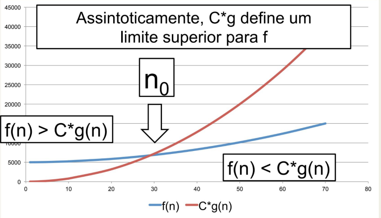
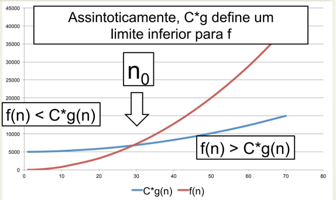
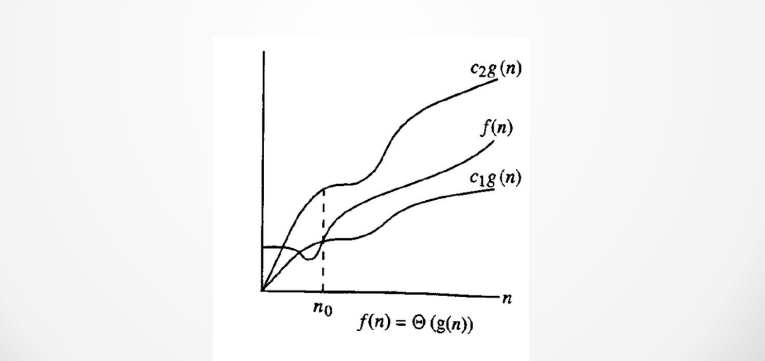

# Algorithms and Data Structures

## Summary

- [. . /Fundamentals](../fundamentals.md)
- [Basics](#basics)
- [Asymptotic Analysis](#asymptotic-analysis)

### Basics

Some definitions to remember:
- Data, register, memory, bit, byte, word, instruction, algorithm and process.

- Process (Stack, Heap, Code Segment->Machine code and Data Segment->Global and static variables)

- Static allocation -> Compile time || Dynamic Allocation -> Runtime

- Function/Method Stack (Parameters, return and local variables). In the end, all data are erased
from memory.

- Recursive function problem -> Data redundancy in memory.

- All pointers have the same size, 8 bytes (0x00A). Explore about ptr size, content, etc.

- When freeing some pointer, assign null after to prevent access to this content.

- Allocation memory problems: Segmentation fault, memory leak and hard debugging;

- Array -> Uniform data type and sequential || Struct -> not homogeneous data block

### Asymptotic Analysis

It's a mathematical approach based on limits to define an algorithm's complexity.

Premises:

> The execution time of an algorithm is the: cost to execute one instruction and the number of times of her are executed.
> 
>  "Simple" instruction have constant execution time.

Some notations:

- Big-O: Like O(n), it's an upper limit in the worst case.

- Ω (Omega): Like Ω(n), it's a lower limit in the worst case.

- Θ (Theta): Like Θ(n), it's between upper and lower limits in the worst case.
  

Example: Binary Search

In a binary search at each step, the search space is divided into two. If you want to find ``10`` in the
array below like this:

> [1,2,4,7,8,10] -> [8,10] -> [10]

At each interaction, we have this kind of behavior:

> 1ª $\frac{n}{2^0}$ $\implies$ 2ª $\frac{n}{2^1}$ $\implies$ 3ª $\frac{n}{2^2}$ ... $\implies$
> nª $\frac{n}{2^{i-1}} = 1$ last step has only one element.
> 
> when n = array size; i = steps.

Resulting in a formula as follows:

> $$\frac{n}{2^{i-1}} = 1$$
> How to know the number of steps (i) based on the array size (n)?

Doing some math:

> $$ \frac{n}{2^{i-1}} = 1 \implies n = 1.2^{i-1} \implies log_2 \space n = log_2 \space 2^{i-1} \implies
log_2 \space n = (i-1) * log_2 \space 2 \implies i = 1 + \log_2 n \  $$

Take care only of the terms that define complexity, we have: $i = \log_2 n$ .

