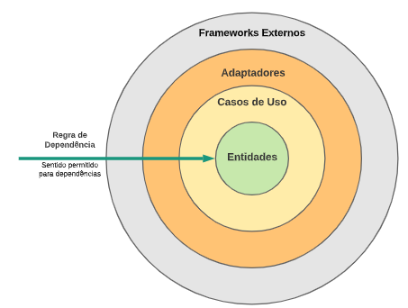
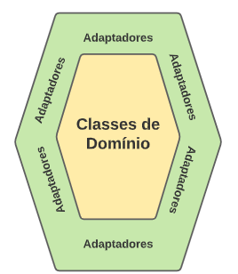

# Software Design

# Summary

- [. . /Home](../README.md)

# Clean Architecture
https://engsoftmoderna.info/artigos/arquitetura-limpa.html

https://blog.cleancoder.com/uncle-bob/2012/08/13/the-clean-architecture.html

In general is called Clean Architecture because the core - entities and use cases - 
are "clean" of any technology.

- Entities and Use Cases
- Adapters
- Frameworks, libs, databases and others third party technologies. 
- Inverted Flow Control - External layer can depend of more internal layers (dependency rule)

> All details stay on frameworks and drivers.
Web is a detail, the database is a detail.
We keeping those technologies in the outer layer because it can do less danger.

# Hexagonal Architecture
https://engsoftmoderna.info/artigos/arquitetura-hexagonal.html

Also know as Port and Adapters, follow the same ideia of Clean Arch that need to be avoided technological dependence from frameworks, databases,
focus on business rules, be easiest to test, etc.

Divide system classes in two main groups:
- Domain classes, that are directly linked with business rules.
- Classes that are related with infra, databases, third party libs, etc.

Domain classes should not depend of infra, database, etc classes.

# DDD
- Core domain, supporting subdomain and generic subdomain

## Building Blocks
- Entity - has unique identifier. They are more important concept.
- Value Object - has no unique identifier, they are characterized by its current state.
- Aggregates - are agreggation/composition of objects handled as a unique abstraction. They are persisted and deleted as a unique too.
- Repositories - they role is to get domain objects of database (even another source like other API?). Its a abstraction for database.
- Domain services - carries business rules independente of objects and is stateless (here i think its about business state, only technical)
- Anticorruption layer - Exchange communication between bounded contexts to not change their ubiquitous language and adapt to each other.
Uses normally services, adapters and facades like: Sistema A -> [ Serviços -> Adaptadores -> Fachada ] -> Sistema B
- Factories - create aggregates.
- Bounded Context - separate ubiquatus language, like a module about library and other finance, when in the first has User and other user become Customer.
- Context Mapping (shared kernel, customer-supplier, anticorruption layer)
- Architectural Layers: ui, application, domain, infra.
- Rich entity - business rules together with entities, likes OO pray.
- Domain event - An event is something that has happened in the past. A domain event is, something that happened in the domain that you want other parts of the same domain (in-process) to be aware of. The notified parts usually react somehow to the events.
- Business Rules Always inside entities and aggregates.