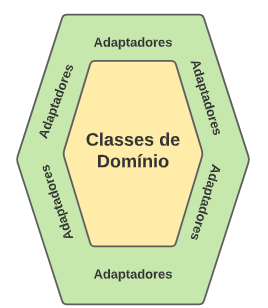

# Software Design

# Summary

- [. . /Home](../README.md)
- [Clean Architecture](#clean-architecture)
- [Hexagonal Architecture](#hexagonal-architecture)
- [Domain Driven Design](#domain-driven-design---ddd)

# Clean Architecture
https://engsoftmoderna.info/artigos/arquitetura-limpa.html

https://blog.cleancoder.com/uncle-bob/2012/08/13/the-clean-architecture.html

In general is called Clean Architecture because the core - entities and use cases - 
are "clean" of any technology.

- Entities and Use Cases
- Adapters
- Frameworks, libs, databases and others third party technologies. 
- Inverted Flow Control - External layer can depend of more internal layers (dependency rule)

> All details stay on frameworks and drivers.
Web is a detail, the database is a detail.
We keeping those technologies in the outer layer because it can do less danger.

# Hexagonal Architecture
https://engsoftmoderna.info/artigos/arquitetura-hexagonal.html

Also know as Port and Adapters, follow the same idea of Clean Arch that need to be avoided technological dependence from frameworks, databases,
focus on business rules, be easiest to test, etc.

Divide system classes in two main groups:
- Domain classes, that are directly linked with business rules.
- Classes that are related with infra, databases, third party libs, etc.

Domain classes should not depend of infra, database, etc classes.

# Domain Driven Design - DDD
Focus on bring the domain problem concepts, naming conventions, contexts and terms to software building blocks, the ubiquitous language. 
Achieving this by collaboration with domain experts and understanding the complexities. 
DDD offer principles, practices and patterns do deal with this approach.

> Domain - this refers to the specific subject area or problem that the software system aims to address.
>
> Driven - the design of the software system is influenced by the features and needs of the domain. Rather than technical aspects.
>
> Design - the process of making a plan or blueprint of a software system (in this approach) driven by domain.

## Strategic Design in DDD
- Bounded Context - breaks down large, complex domains into smaller, more manageable parts. 
Separate ubiquitous language / clear boundaries between concepts (even with same name), like a module about library and other finance, when in the first has User and other user become Customer.
-  Context mapping - The process of defining relationships and interactions between different Bounded Contexts.
Understand where context overlap or integrate, establishing clear communication and agreements.
   - Shared Kernel - two contexts deliberately share a small part of the domain model or codebase.
   - Partnership — two bounded contexts cooperate closely and coordinate changes.       
   - Customer-Supplier - one context acts as the supplier (upstream), while another is the customer (downstream); the supplier takes the customer’s needs into account. Upstream listens to downstream needs.
-  Strategic Patterns - General guidelines for organizing the architecture of a software system in alignment with the problem domain.
   -  Aggregates - protects consistency inside domain model.
   -  Domain Events - something that happened in the domain that you want other parts of the same domain (in-process) to be aware of.
   -  Anti-Corruption Layer - contains all the logic necessary to translate between the two systems or bounded contexts.
-  Shared Kernel - a strategic pattern that identifies common areas between different Bounded Contexts and establishes a shared subset of the domain model.
- Architectural Layers: ui, application, domain, infra.
-  Ubiquitous Language - is a shared vocabulary that all stakeholders use consistently during software development, effectively capturing the relevant domain knowledge.
Common goal is to share domain language among teams.

## Tactical Design Patterns in DDD
- Entity - has unique identifier. They are more important concept.
- Rich entity - business rules together with entities, likes OOP pray.
- Value Object - has no unique identifier, they are characterized by its current state.
- Aggregates - are aggregation/composition of objects handled as a unique abstraction. They are persisted and deleted as a unique too. Has the root entity aggregate concept.
- Repository - they role is to get domain objects of database (even another source like other API?). Its a abstraction for persistence. They encapsulate translation/mapping between those objects.
- Factory - creational design pattern.
- Service - carries business rules independent of objects and is stateless.
